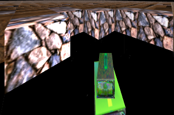
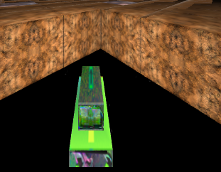
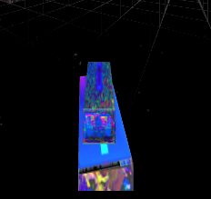
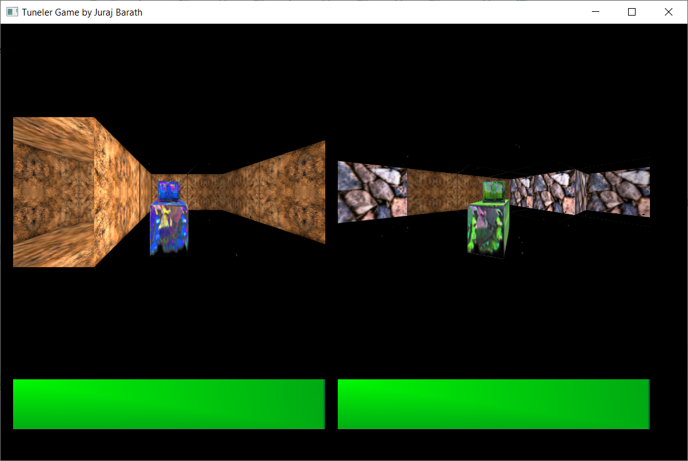
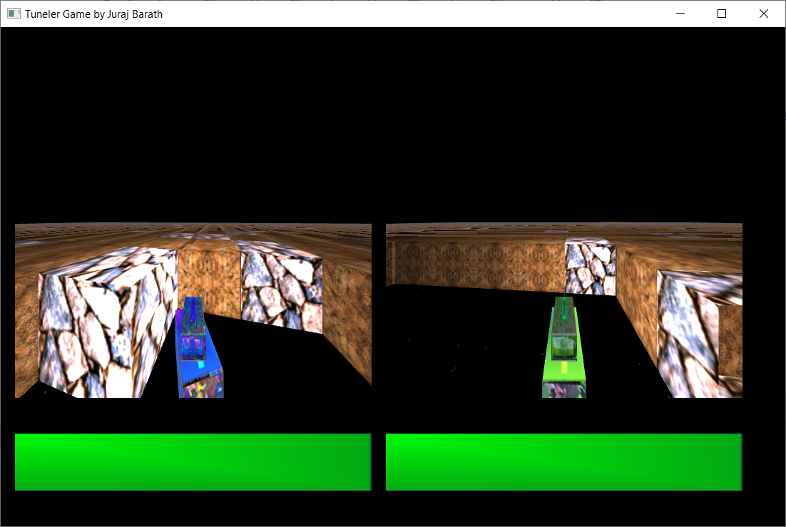
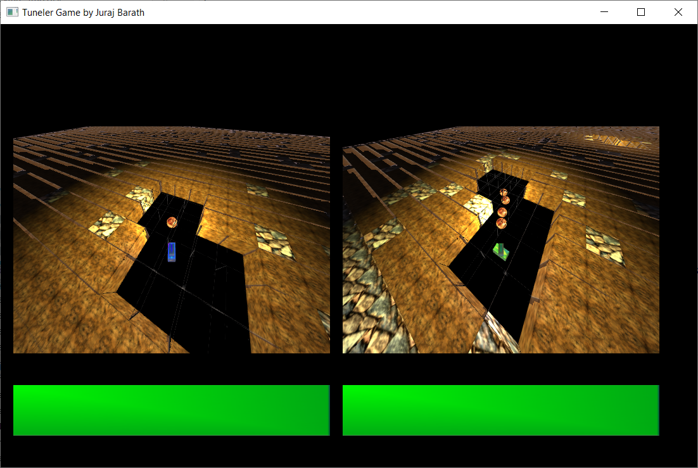
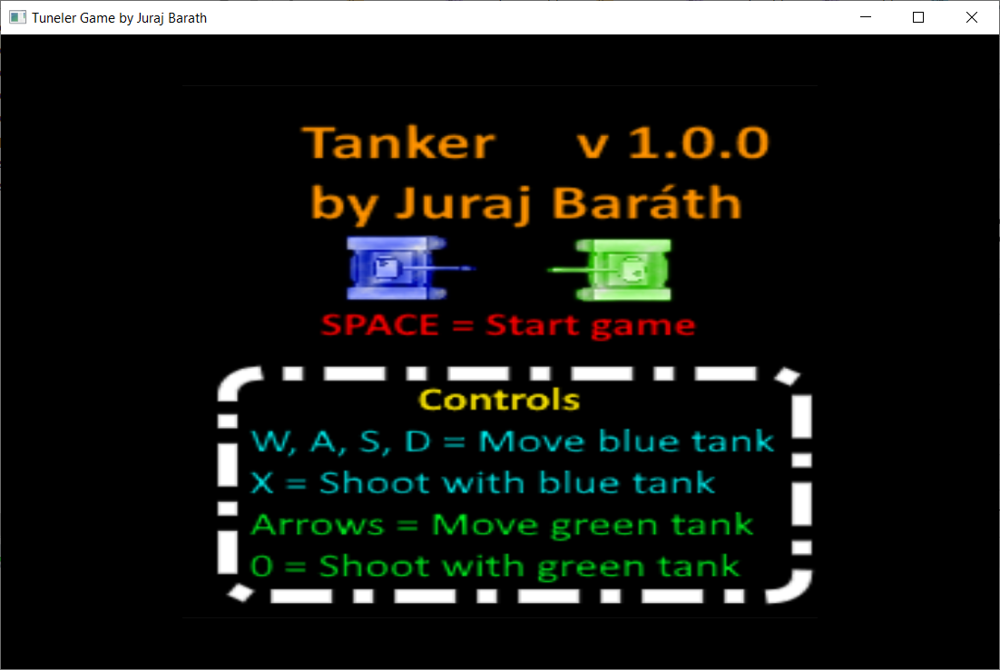
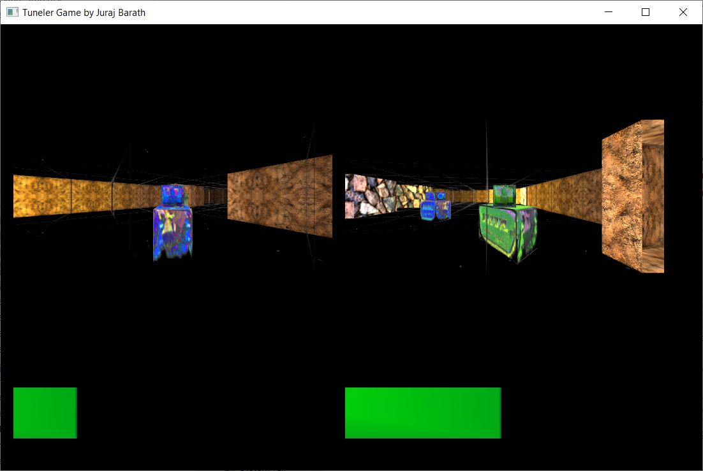
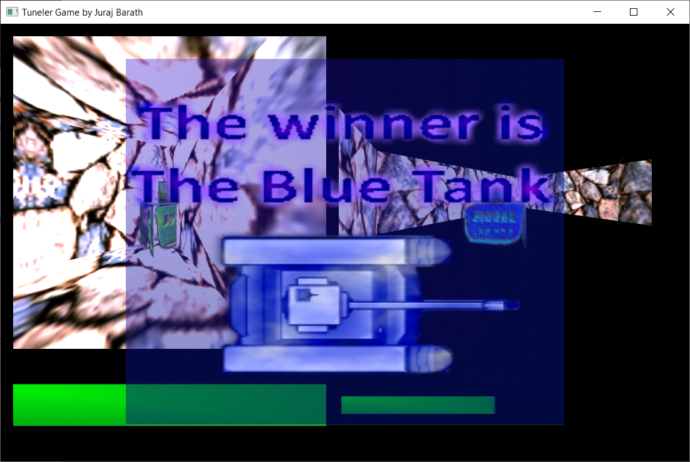
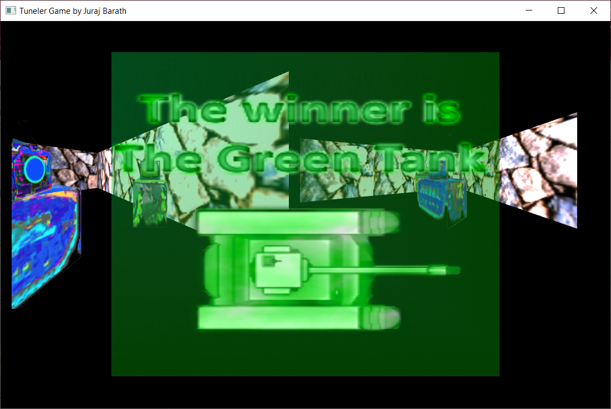

# Tanker 3D

**Created by:** Juraj Baráth

## About

Tanker 3D is a **3D** C++ OpenGL based implementation of the 2D Tanker retro game.

## Objective

Your objective is to kill the other tank by shooting him at least 5 times quickly.

## Health system
This implementation only contains tank HP level, and no energy level.

In the beginning of the game both tanks have 100 health.

If the enemy tank shoots to you, then you lose 25 health.

After that in every 0.4 seconds you regenerate 1 health, until you reach 100 again.

## Lighting system
By default all the blocks are in the dark, having only 15% lightness.

### Tanks
Tanks can lights up a circular area in up to 6.25 blocks around themselves with a white
lighting color.

Of course the light is not spread equally in that 6.25 blocks radius. The further the block
is from the tank the less lightning it gets. However if the block is too close, to the tank,
then it gets way too much light, and might look way too bright.

The ideal distance for getting the perfect lighting conditions (not too bright and not
too dark) is 2 blocks.

### Bullets
Shooting bullets can not only help in destroying dirt blocks and killing your enemy
tank, but they are also extremely useful for temporarily lighting up the area.

They have a 2x more powerful lighting than the tanks have, but that light is
yellow and not white, for better representing the bullets actual color.

## Bullet management

Tanks needs to shoot bullets for being able to kill the other tank. Those bullets are also
able to break dirt blocks, but only one at a time.

For being more realistic bullets always not only get their initial shooting speed, 
but they also get an acceleration effect from both gravity and the wind.

The gravity effect is always the same, while the wind effect is randomized at every bullet shot.

That's the reason why you will actually never be able to shoot straight and shoot to a too big
distance.

### Shooting

For being able to spawn a bullet you need to use the **X** key for the blue tank
and the num pad key **0** for the green tank.

To avoid causing lag by shooting too many bullets at once and to make bullets not being
over powered, bullet shooting is rate limited to **150** milliseconds / bullet. That means
that you can only shoot around **6.66** bullets every second.  

### Target hitting & despawning

After a certain time the gravity effects causes the bullets to reach the ground level. If that
happens, then they automatically despawn.

They also despawn automatically if they hit a target.

That target can be either a **stone block**, in which case they don't do any damage at all.

It can also be a **dirt block**, in which case the dirt block gets also broken when the bullet despawns.

And finally as it was mentioned previously, it can also be the enemies tank.

The bullets are able to go through the bullet **shooter tank** and the **tunnel blocks** of the map.  

# Blocks of the map

The map consists of 3 types of blocks:

### Stone

You can find stone blocks on the side of the map and with each block
on the map has a 10% chance of being a stone by default as well.

The purpose of the stone block is that it's indestructible. So the tanks
can **not** go through it, and they also can **not** shoot through it. 

### Dirt

This is the most common block on the map. Each none side block has a 90% chance
of being a dirt block by default.

Tanks can go through this block to convert it to a tunnel block.

They can also shoot bullets to it. One bullet can always destroy one dirt block at once. 

### Tunnel

Tunnel block is created when tanks either go through a dirt block or shoot to it.

This block is completely transparent and bullets can go through it.

# Camera view modes

The game comes with the following 3 different camera view modes, which are toggleable by the **V** character:

### Horizontal view
You can only see the blocks which are next to your tank and nothing else. This mode makes finding the
other tank on the map the hardest.

 

### Increased Y view
In this mode the camera is moved upwards by 1 block, which allows you to see some more around your
tank, not only the ones which are next to your tunnel
 

### 3D view from the upside
This mode moves the camera up by 3 blocks and makes it look much more downwards. That way you will be able
to see almost the whole map at once. And that way tanks can super easily find each other. 

As you can see on the picture bellow the green tank on the right side can already see the light of the
blue tanks shot bullet. 
 

## Tank head and body rotation

For rotating only the tanks **head** you need to press the *rotation control keys only without
pressing the tank movement keys.

The tanks shooting direction is always calculated based on the tanks head rotation. 

If you would like to move the tanks body to it's head you can press a tank movement key. 

## Info message

    INFO:
    Blue Tank: {pos = 1 -4, hp = 100, rot = 0, mat = T}
    Green Tank: {pos = 18.6625 1.22754, hp = 100, rot = -0.0852976, mat = T}

If you press the **I** character on your keyboard during the game, then you will
be able to see an info message popping up in the console, similar to the above one.

The info message contains the following 4 important information about both two tanks:
- **pos:** The tanks position on the map
- **hp:** The tanks health level
- **rot:** The tanks rotation in radians
- **mat:** The material of the block where the tank is standing 

# Screens

The game consists 

## Main screen

The main screen includes the games version, author, and the basic controls for playing the game.

It does not contain any info about the additional control keys.
You can read about them under the controls section.

You can see the main screen when you launch the application and after pressing the **SPACE** key on one
of the tank win screens.

If you press the **SPACE** key on the main screen thr

## Game screen

The game screen shows the actual game in the selected camera view mode and it also shows the health bar
of both two tanks.

After one of the tanks get killed an automated camera animation will start which shows the map after the
game from various angles and rotations.

Together with that animation a zooming in animation will start showing the win screen of the tank which
survived the fight.

## Blue tank win screen

This is how the blue tanks winner screen looks like.

For being able to go back to the main menu you need to press the **SPACE** key.

## Green tank win screen

This is how the green tanks winner screen looks like.

For being able to go back to the main menu you need to press the **SPACE** key.

# Controls

The games controls can be divided into the following 3 different categories:

## Special
Action         |    Key      |
---------------|-------------|
Show info about the tanks current positions                 | I           |
Switch between camera view modes                            | V           |
Go back to main menu from the win screen or start the game  | SPACE |
Exit game                                                   | ESC, ALT+F4 |

## Blue tank
Action         |    Key      |
---------------|-------------|
Move forward   | W           |
Move backward  | S           |
Rotate to the left side  | A |
Rotate to the right side | D |
Shoot          | X           |

## Green tank
Action         |    Key      |
---------------|-------------|
Move upwards   | up arrow    |
Move downwards | down arrow  |
Rotate to the left side  | left arrow  |
Rotate to the right side | right arrow |
Shoot          | Numpad 0    |

# Installation

## Running the pre-compiled application

1. Clone this repository
2. Go to the **Tanker3D** folder
3. Run the **Tanker3D.exe** file 

## Compilation

1. Download the latest **MinGW** version
2. At the installation change the **i686** option to **x86_64**
3. Set the installation directory to a one which does not contain any spaces
4. Download and install **CMake 3.13.5**, do not install any newer version of it,
because Tanker3D does **NOT** work with such versions, I have tested that.
5. Download and install the latest **Clion** version
6. Clone this repository
7. Open this project with **Clion**
8. Choose **Run..** from the **Run** menu
9. Select **Tanker3D**
10. Enjoy
